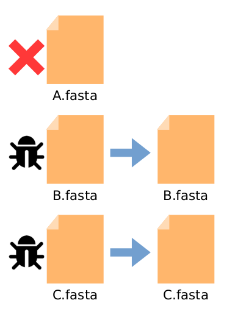

# Project: Genome Fuzzing

## Wiki introduction

This wiki explains in detail the algorithms implemented in the project *Genome Fuzzing*. 

## Principle

This tool looks for the minimal input data that causes a given program to return a given output. The input data can be a fasta file containing one or multiple sequences, or it can be a file of files: a text file with paths to many fasta files.

### 1. File suppression

First, the program removes individually entire files from the input while checking that the output is maintained. If the output is lost whithout a file, we keep it. 

### 2. Sequence suppression

After that, for each file kept the program removes individually the sequences of the fasta file while checking that the output is maintained. 

### 3. Sequence reduction

After that, each sequence kept has to be reduced, to isolate the sub-sequence(s) causing the desired output. We use binary search to do so: at each step we halve the sequence, and check if each half causes the desired output. 

If one of the two halves replacing the original sequence in the data causes the desired output, we keep it. If they both cause the desired output, we keep one of them at random. In both cases, we continue the binary search on the sub-sequence kept. 

If none of them causes the specified output, there are two possible explanations: either we cut the target sequence in half, or there are multiple target sequences on both sides of the cut. In this second case, the sequences cause the desired output only when they are both present, and we call them co-factor sequences. 

### 4. Co-factor sequences

To check if there are co-factor sequences, we temporarily add to the data two separate sequences with each half of the sequence code, and check if this gives the desired output. If it does, we then continue to reduce these individually like any other sequence. 

For now, if one of multiple co-factor sequences is cut in half, we can not detect it. We treat this case as if it were one target sequence containing the two sub-seq, so unnecessary nucleotides will remain in between the co-factor sequences. 

### 5. Target sequence cutted in half

If no previous case apply, it means that we tried to cut the target sequence in half. To reduce it to the minimum, we cut out some nucleotides at the begining and at the end of the sequence. We use binary search to find where are the first and the last nucleotides needed to cause the desired output.

For example, to find the first nucleotide we halve the first half of the sequence to get two quarters. If the desired output is obtained without the first quarter, we remove it and continue the binary search on the second quarter. Else we keep the entire sequence for now and continue the search on the first quarter. With this method, we are sure to cut out exactly all unnecessary nucleotide. 

## Subprocess parallelisation

The most time-consumming operation of the program is to check if the command line still gives the desired output with the data. To reduce the duration of this subprocess, we parallelised the execution of the three checks on first half, second half and both halves of a sequence. 

In practical, the sequences for each case are written in files in separate directories. Then the three process are launched at the same time in each directory. The first one that stops with the desired output triggers the interruption of the others. Except if it is the process where both sequences has to be kept, then we check if any other process gives the desired output instead, before keeping it otherwise. We did this to keep the minimum number of sequences during the execution. 

We continue the program with the sequences written in the directory of the first process with the desired output. 
